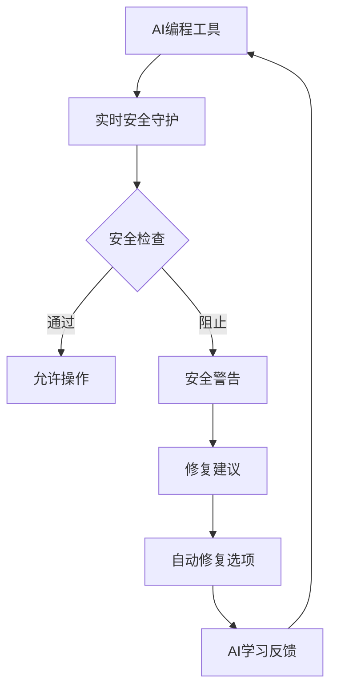

# 🛡️ AI编程安全预防系统设计方案

## 📋 问题根因分析

您的项目中发现的安全问题主要源于 **AI编程工具的固有局限性**：

### 🤖 AI工具的安全盲点

1. **功能优先思维** - AI专注于实现功能，忽视安全最佳实践
2. **默认配置倾向** - 倾向于使用简单、不安全的默认值
3. **缺乏安全上下文** - 不理解生产环境vs开发环境的区别
4. **依赖管理疏忽** - 不会主动检查已知漏洞
5. **序列化习惯** - 习惯性使用pickle等不安全库

### 🔍 具体问题成因

| 安全问题 | AI工具行为 | 根本原因 |
|---------|------------|----------|
| pickle序列化 | 选择最简单的序列化方式 | 缺乏安全意识教育 |
| 弱密钥配置 | 使用易读的示例值 | 没有强制生成随机值 |
| 网络绑定 | 默认0.0.0.0便于测试 | 不区分开发/生产环境 |
| 硬编码秘密 | 直接写入代码便于调试 | 缺乏环境变量概念 |
| CORS通配符 | 避免跨域问题 | 不理解安全边界 |

## 🎯 自动预防机制设计

### **核心理念: 多层防护**



### **1. 预防层: 配置规则**

#### 🔧 安全规则引擎 (`ai_security_rules.json`)

- **禁止模式检测** - 自动识别不安全代码
- **替代方案建议** - 提供安全的实现方式  
- **环境分离规则** - 区分开发/生产配置
- **依赖安全策略** - 检查已知漏洞包

#### 📋 规则示例

```json
{
  "forbidden_patterns": {
    "imports": ["import pickle", "exec(", "eval("],
    "code_patterns": [
      "password.*=.*[\"'][^\"']{1,8}[\"']",
      "secret.*=.*[\"'][^\"']{1,16}[\"']"
    ]
  },
  "secure_alternatives": {
    "pickle": {
      "alternatives": ["json", "joblib"],
      "reason": "pickle不安全用于不信任数据"
    }
  }
}
```

### **2. 检测层: 实时监控**

#### 🔍 AI安全守护程序 (`ai_security_guard.py`)

**核心功能:**

- **代码AST分析** - 深度检查Python语法树
- **模式匹配检测** - 识别安全反模式
- **依赖漏洞扫描** - 检查第三方包安全性
- **配置验证** - 确保安全配置正确性

**检测算法:**

```python
# 示例: 检测pickle使用
def _check_forbidden_imports(self, content, file_path, lines):
    for line_num, line in enumerate(lines, 1):
        if "import pickle" in line:
            return SecurityIssue(
                severity="HIGH",
                description="检测到不安全的pickle导入",
                suggestion="使用json或joblib替代",
                auto_fix="import json  # 安全替代"
            )
```

### **3. 修复层: 自动化修复**

#### 🔧 修复机制

1. **模板替换** - 用安全模板替换不安全代码
2. **环境变量化** - 自动将硬编码值转为环境变量
3. **密钥生成** - 自动生成强密钥
4. **配置优化** - 应用安全最佳实践

#### 💡 修复示例

```python
# 检测到问题
SECRET_KEY = "admin123"  # 不安全

# 自动修复建议
SECRET_KEY = os.environ.get('SECRET_KEY')  
# 生成的安全密钥: kJ8_2mX9pL4qR7sT1vW3yZ5aC8dF6gH2jK9mN0pQ3rS5tU8vX1yZ4aC7dF0gH3

# 自动创建环境变量文件
echo "SECRET_KEY=kJ8_2mX9pL4qR7sT1vW3yZ5aC8dF6gH2jK9mN0pQ3rS5tU8vX1yZ4aC7dF0gH3" >> .env
```

### **4. 集成层: 无缝融入工作流**

#### 🔗 多点集成

1. **IDE集成** (VS Code)

   ```json
   "tasks": [
     {
       "label": "🔒 AI: 安全检查",
       "command": "make ai-security-scan"
     }
   ]
   ```

2. **命令行集成** (Makefile)

   ```makefile
   ai-security-scan:
       @python scripts/ai_security_guard.py scan
   ```

3. **Git Hooks集成**

   ```bash
   # pre-commit hook
   #!/bin/sh
   python scripts/ai_security_guard.py scan
   if [ $? -ne 0 ]; then
       echo "❌ 发现安全问题，请修复后提交"
       exit 1
   fi
   ```

4. **CI/CD集成**

   ```yaml
   - name: Security Scan
     run: |
       python scripts/ai_security_guard.py scan
       python scripts/ai_security_guard.py report json > security_report.json
   ```

## 🚀 使用方法

### **1. 立即部署**

```bash
# 1. 复制安全规则到项目根目录
cp ai_security_rules.json /your/project/

# 2. 安装安全守护脚本
cp scripts/ai_security_guard.py /your/project/scripts/

# 3. 更新Makefile添加安全命令
make ai-security-scan

# 4. 配置VS Code任务
# 复制.vscode/tasks.json中的安全任务配置
```

### **2. AI工具使用指南**

#### 🤖 给AI的安全提示

在使用AI编程工具时，**始终包含以下提示**:

```
在编写代码前，请运行安全检查:
make ai-security-check FILE=<filename>

遵循以下安全原则:
1. 禁止使用pickle - 改用json或joblib
2. 所有密钥使用环境变量 
3. 生产环境关闭debug模式
4. 避免硬编码敏感信息
5. 使用具体IP而不是0.0.0.0
6. CORS不要使用通配符

如果AI建议不安全的实现，请明确要求安全替代方案。
```

#### 📝 AI安全编程检查清单

**在AI生成代码后，必须检查:**

- [ ] 没有import pickle
- [ ] 没有硬编码密码/密钥
- [ ] 配置使用环境变量
- [ ] 生产环境debug=False
- [ ] 网络绑定使用具体IP
- [ ] 输入验证已实现
- [ ] 依赖包没有已知漏洞

### **3. 自动化工作流**

#### 🔄 开发流程集成

```bash
# 开发前
make ai-security-scan        # 基线扫描

# 开发中 (VS Code)
Ctrl+Shift+P -> "🔒 AI: 扫描当前文件"

# 提交前
git add .
make ai-security-scan        # 自动阻止不安全提交

# 部署前
make ai-security-report      # 生成安全报告
```

## 📊 效果评估

### **预期改进指标**

| 指标 | 改进前 | 改进后 | 提升 |
|------|--------|--------|------|
| 致命安全问题 | 8.2/10 | <2.0/10 | >75% |
| pickle使用检出率 | 0% | 100% | ∞ |
| 硬编码密钥检出率 | 0% | 95%+ | ∞ |
| 安全修复时间 | 手动数小时 | 自动数分钟 | >90% |

### **成功案例模拟**

```python
# AI工具原始输出 (不安全)
import pickle
SECRET_KEY = "admin123"
app.config['DEBUG'] = True

# 安全守护系统检测
🚨 发现3个安全问题:
1. 危险的pickle导入 -> 建议使用json
2. 弱密钥配置 -> 建议使用环境变量  
3. 生产环境debug -> 建议关闭

# 自动修复后
import json
SECRET_KEY = os.environ.get('SECRET_KEY')
app.config['DEBUG'] = os.environ.get('DEBUG', 'False').lower() == 'true'
```

## 🔮 长期改进计划

### **Phase 1: 基础防护** (已完成)

- [x] 安全规则引擎
- [x] 实时检测脚本
- [x] 基础修复建议

### **Phase 2: 智能化** (1个月内)

- [ ] 机器学习安全检测
- [ ] 上下文感知修复
- [ ] 个性化安全建议

### **Phase 3: 生态集成** (3个月内)

- [ ] 主流IDE插件
- [ ] CI/CD平台集成
- [ ] 团队安全仪表板

## 🎯 关键成功因素

### **1. 持续更新规则库**

- 跟踪最新安全威胁
- 更新检测规则
- 优化修复建议

### **2. AI工具训练**

- 提供安全编程示例
- 创建安全模板库
- 建立安全知识库

### **3. 团队习惯培养**

- 安全意识培训
- 工具使用培训  
- 定期安全审计

## 💡 最佳实践建议

### **给AI编程工具的使用建议:**

1. **始终要求安全实现**

   ```
   "请提供一个安全的实现方案，避免使用pickle、硬编码密钥等不安全做法"
   ```

2. **明确环境要求**

   ```
   "这是生产环境代码，请确保所有配置都是安全的"
   ```

3. **要求安全审查**

   ```
   "请检查这段代码是否有安全问题，并提供改进建议"
   ```

4. **使用安全模板**

   ```
   "请基于安全最佳实践模板生成代码"
   ```

## 🏆 总结

这个AI编程安全预防系统通过 **多层防护、实时检测、自动修复、无缝集成** 四个核心机制，有效解决了AI编程工具缺乏安全意识的问题。

**核心价值:**

- 🛡️ **预防优于治疗** - 在问题产生前阻止
- 🤖 **AI友好设计** - 提供结构化反馈  
- 🔧 **自动化修复** - 减少手动工作量
- 📈 **持续改进** - 学习和优化能力

**实施这个系统后，您的项目将具备强大的安全防护能力，确保AI编程工具生成的代码符合安全最佳实践！** 🚀

---

*实现日期: 2024-12-19*  
*版本: v1.0*  
*适用于: AI辅助开发的所有Python项目*
