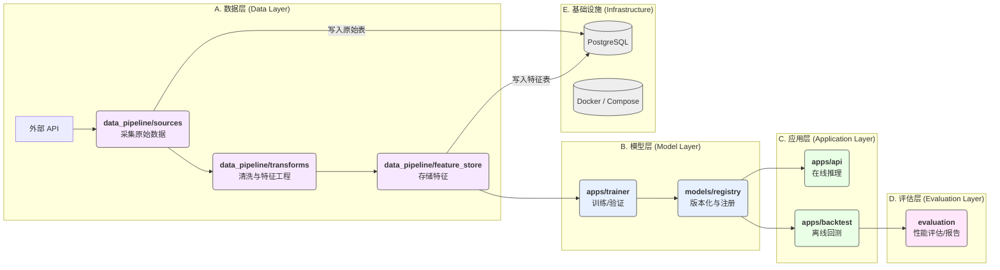

# 足球赛果预测系统 - 架构设计 (MVP)

本文档旨在提供项目在 MVP (Minimum Viable Product) 阶段的核心架构视图，确保团队对模块职责、数据流和技术选型有统一的理解。

## 1. 核心模块职责

| 模块 (Module) | 核心职责 (Core Responsibility) | 关键技术/库 |
| :--- | :--- | :--- |
| **`apps/api`** | 提供 RESTful API 接口，用于模型推理、健康检查和指标监控。 | FastAPI, Pydantic, Uvicorn |
| **`apps/trainer`** | 负责模型的训练、验证和调优。 | XGBoost, scikit-learn, pandas |
| **`apps/backtest`** | 提供回测引擎，用于评估模型在历史数据上的表现。 | pandas, numpy |
| **`apps/workers`** | 定义和执行后台任务和数据流水线。 | Prefect (or Celery) |
| **`data_pipeline`** | 包含数据采集、特征工程和特征存储的完整流程。 | requests, pandas, SQLAlchemy |
| **`models`** | 模型注册表，负责模型的版本管理、存储和加载。 | pickle, JSON, file system |
| **`infra`** | 基础设施配置，包括 Docker、数据库脚本和部署配置。 | Docker Compose, shell scripts |
| **`evaluation`** | 模型评估模块，生成详细的性能报告和可视化图表。 | scikit-learn, matplotlib |

## 2. 数据与调用流 (Data & Calling Flow)

下图描述了从数据采集到最终 API 推理的完整流程：

