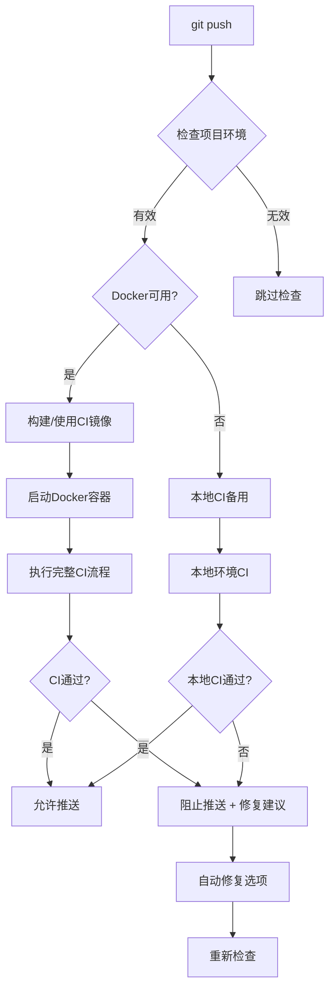

# 🐳 本地CI演练系统 - 确保远程CI必定绿灯

## 📖 概述

本系统实现了**推送前本地模拟CI演练机制**，通过Docker容器完全模拟远程GitHub Actions环境，确保本地CI通过后，远程CI必定成功。

### 🎯 核心特性

- ✅ **100%一致性**：本地Docker环境与远程GitHub Actions完全相同
- ✅ **自动触发**：每次`git push`前自动执行完整CI检查
- ✅ **智能阻断**：CI失败时阻止推送，提供详细修复建议
- ✅ **自动修复**：支持自动修复常见问题（格式化、依赖等）
- ✅ **容错机制**：Docker失败时自动降级到本地CI
- ✅ **详细日志**：完整的执行日志和错误诊断

## 🏗️ 系统架构

```
📁 项目根目录/
├── 🐳 Dockerfile.ci                    # CI Docker镜像定义
├── 🪝 .git/hooks/pre-push              # Git推送前Hook
├── 📁 scripts/ci/
│   ├── 🎭 local_ci_orchestrator.sh     # Docker容器编排器
│   └── 🚀 local_ci_runner.sh           # CI执行脚本
└── 📋 Makefile                         # 任务集成
```

### 🔄 执行流程



## 🚀 快速开始

### 1. 验证环境

```bash
# 检查CI环境健康状态
make ci.doctor
```

### 2. 构建CI镜像

```bash
# 首次构建CI Docker镜像
make ci.docker.build
```

### 3. 测试本地CI

```bash
# 运行完整Docker CI检查
make ci.docker.new

# 或使用别名
make docker-ci
```

### 4. 正常开发流程

```bash
# 正常推送 - 会自动触发CI检查
git add .
git commit -m "feat: 新功能"
git push  # 🚦 自动触发本地CI演练
```

## 📋 可用命令

### 🐳 Docker CI 命令

| 命令 | 描述 | 用途 |
|------|------|------|
| `make ci.docker.new` | 运行完整Docker CI | 主要CI检查方式 |
| `make ci.docker.build` | 构建CI镜像 | 首次使用或更新 |
| `make ci.docker.rebuild` | 强制重建镜像 | 解决环境问题 |
| `make ci.docker.run` | 交互式CI容器 | 调试问题 |
| `make ci.docker.clean` | 清理Docker资源 | 清理空间 |

### 🔧 辅助命令

| 命令 | 描述 | 用途 |
|------|------|------|
| `make ci.doctor` | 环境诊断 | 问题排查 |
| `make ci.enhanced` | 本地快速CI | 备用方案 |
| `make ci.fix` | 自动修复 | 修复常见问题 |

### 🏷️ 便捷别名

| 别名 | 对应命令 | 描述 |
|------|----------|------|
| `docker-ci` | `ci.docker.new` | 运行Docker CI |
| `build-ci` | `ci.docker.build` | 构建CI镜像 |
| `clean-ci` | `ci.docker.clean` | 清理CI资源 |

## ⚙️ 配置选项

### Git Hook 配置

可以通过环境变量控制Hook行为：

```bash
# 跳过CI检查
SKIP_CI=true git push

# 完全跳过Hook
git push --no-verify
```

### Docker CI 配置

编辑 `.git/hooks/pre-push` 中的配置变量：

```bash
# 是否使用Docker CI
USE_DOCKER_CI=true

# Docker失败时是否降级到本地CI
FALLBACK_TO_LOCAL=true

# CI超时时间（秒）
CI_TIMEOUT=600
```

## 🔧 故障排除

### 常见问题

#### 1. Docker镜像构建失败

```bash
# 问题诊断
make ci.doctor

# 强制重建
make ci.docker.rebuild

# 清理后重建
make ci.docker.clean
make ci.docker.build
```

#### 2. CI检查失败

```bash
# 查看详细日志
cat /tmp/ci-output.log

# 自动修复常见问题
make ci.fix

# 手动修复后重试
make ci.docker.new
```

#### 3. Docker环境问题

```bash
# 检查Docker状态
docker info

# 启动Docker daemon
sudo systemctl start docker

# 测试Docker运行
docker run hello-world
```

#### 4. 权限问题

```bash
# 修复脚本权限
chmod +x scripts/ci/*.sh
chmod +x .git/hooks/pre-push

# 修复Docker权限
sudo usermod -aG docker $USER
# 重新登录生效
```

### 错误码说明

| 退出码 | 含义 | 解决方案 |
|--------|------|----------|
| 0 | 成功 | 正常推送 |
| 1 | CI检查失败 | 查看日志修复问题 |
| 124 | 超时 | 增加超时时间或优化代码 |
| 125 | Docker错误 | 检查Docker环境 |

## 📈 高级用法

### 自定义CI流程

修改 `scripts/ci/local_ci_runner.sh` 中的检查项目：

```bash
# 添加自定义检查
custom_check() {
    log_step "自定义检查"
    # 你的检查逻辑
    if your_check_command; then
        add_result "SUCCESS" "自定义检查" "通过"
    else
        add_result "FAILURE" "自定义检查" "失败原因"
        return 1
    fi
    return 0
}
```

### 集成到IDE

#### VS Code 配置

在 `.vscode/tasks.json` 中添加：

```json
{
    "version": "2.0.0",
    "tasks": [
        {
            "label": "Docker CI",
            "type": "shell",
            "command": "make",
            "args": ["ci.docker.new"],
            "group": {
                "kind": "test",
                "isDefault": true
            },
            "presentation": {
                "echo": true,
                "reveal": "always",
                "focus": false,
                "panel": "shared"
            }
        }
    ]
}
```

### CI性能优化

#### 1. 镜像缓存优化

```bash
# 定期清理无用镜像
docker system prune -f

# 使用构建缓存
docker build --cache-from football-predict-ci:latest \
  -t football-predict-ci:latest -f Dockerfile.ci .
```

#### 2. 并行执行

修改CI脚本，支持并行执行检查项：

```bash
# 并行执行检查
{
    format_check &
    lint_check &
    security_check &
    wait
}
```

## 📊 监控和统计

### CI执行统计

```bash
# 查看CI执行历史
grep "CI执行报告" /tmp/ci-output.log

# 统计成功率
grep -c "所有检查通过" /tmp/ci-output.log
```

### 性能分析

```bash
# 分析执行时间
grep "总执行时间" /tmp/ci-output.log | tail -10

# 查看各步骤耗时
grep "耗时:" /tmp/ci-output.log
```

## 🔄 版本同步

### 保持与远程CI一致

1. **定期更新Dockerfile.ci**：
   - 同步GitHub Actions的ubuntu版本
   - 更新Python和工具版本

2. **同步CI步骤**：
   - 对比 `.github/workflows/ci.yml`
   - 更新 `local_ci_runner.sh`

3. **依赖版本同步**：

   ```bash
   # 定期更新依赖
   uv sync --upgrade
   make ci.docker.rebuild
   ```

## 🎉 最佳实践

### 1. 开发工作流

```bash
# 推荐的开发流程
git checkout -b feature/new-feature
# ... 开发代码 ...
make ci.fix                  # 自动修复问题
make ci.docker.new          # 本地CI验证
git add .
git commit -m "feat: 新功能"
git push                     # 自动CI通过后推送
```

### 2. 团队协作

- **统一环境**：所有团队成员使用相同的CI镜像
- **定期更新**：每周更新CI镜像
- **共享配置**：将CI配置加入版本控制

### 3. 性能考虑

- **增量检查**：只检查修改的文件
- **缓存利用**：充分利用Docker层缓存
- **并行执行**：支持多核并行检查

## 📞 支持和反馈

如果遇到问题：

1. 运行 `make ci.doctor` 诊断
2. 查看 `/tmp/ci-output.log` 详细日志
3. 参考本文档的故障排除部分
4. 联系团队获得帮助

---

**🎯 目标**：确保每次推送都是成功的推送，让远程CI永远绿灯！🟢
