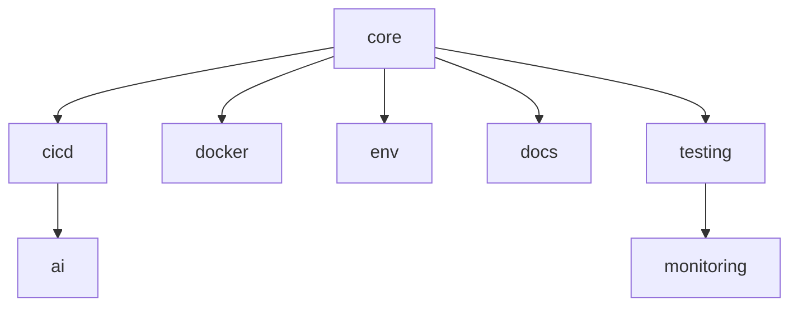

# 🎯 脚手架模块化系统

> **世界级模块化脚手架** - 智能、灵活、可扩展的开发环境管理方案

## 🌟 系统特色

### ✨ 核心亮点

- **🧩 模块化设计**: 8个独立模块，按需安装
- **🤖 智能管理**: AI驱动的依赖解析和冲突检测
- **📦 预设包**: 4种场景预设，开箱即用
- **🔄 版本控制**: 独立模块版本管理和升级
- **🛡️ 自动回滚**: 安装失败自动恢复

### 🎚️ 可用模块

| 模块 | 描述 | 文件数 | 复杂度 |
|------|------|--------|---------|
| 🏗️ **core** | 核心基础模块 | 8个 | 低 |
| 🔧 **cicd** | CI/CD流水线 | 12个 | 中 |
| 🐳 **docker** | 容器化部署 | 13个 | 中 |
| ⚙️ **env** | 环境管理 | 10个 | 低 |
| 🤖 **ai** | AI辅助工具 | 10个 | 高 |
| 🧪 **testing** | 测试框架 | 10个 | 中 |
| 📊 **monitoring** | 监控分析 | 11个 | 中 |
| 📚 **docs** | 文档系统 | 12个 | 低 |

### 📦 预设包选择

| 预设包 | 适用场景 | 包含模块 | 安装时间 |
|--------|----------|----------|----------|
| 🚀 **Minimal** | 个人项目 | core + cicd-basic | 30秒 |
| 🏢 **Professional** | 团队项目 | core + cicd + docker + env | 1分钟 |
| 🌟 **Enterprise** | 企业级 | 全部模块 | 2分钟 |
| 🤖 **AI-Enhanced** | AI驱动 | core + cicd + ai + monitoring | 1.5分钟 |

---

## 🚀 快速开始

### 方式一：使用增强版安装器（推荐）

```bash
# 启动交互式安装
./scaffold-modules/tools/enhanced-installer.sh

# 或直接安装预设包
./scaffold-modules/tools/enhanced-installer.sh --preset professional

# 或安装特定模块
./scaffold-modules/tools/enhanced-installer.sh --install core cicd docker
```

### 方式二：使用Python模块管理器

```bash
# 查看可用模块
python scaffold-modules/tools/module-manager.py list

# 安装模块
python scaffold-modules/tools/module-manager.py install core cicd

# 查看状态
python scaffold-modules/tools/module-manager.py status

# 卸载模块
python scaffold-modules/tools/module-manager.py uninstall ai
```

### 方式三：使用原有安装器

```bash
# 交互式安装
./installer/scaffold-installer.sh --interactive

# 列出模块
./installer/scaffold-installer.sh --list-modules
```

---

## 🛠️ 详细使用指南

### 📋 系统要求

**基础要求:**

- Python >= 3.11
- Git >= 2.30
- Poetry >= 1.5.0

**可选要求:**

- Docker >= 20.10 (docker模块)
- Pre-commit >= 2.15.0 (cicd模块)

### 🔧 安装步骤

1. **检查系统要求**

   ```bash
   python --version  # 应该 >= 3.11
   git --version     # 应该 >= 2.30
   poetry --version  # 应该 >= 1.5.0
   ```

2. **选择安装方式**
   - 新手推荐：交互式安装
   - 自动化：命令行直接安装
   - 定制化：使用Python模块管理器

3. **验证安装**

   ```bash
   # 查看已安装模块
   python scaffold-modules/tools/module-manager.py status

   # 运行健康检查
   python scripts/health-check.py
   ```

### 📊 模块依赖关系



### 🎯 使用场景

#### 个人开发者

```bash
# 选择最小化配置
./scaffold-modules/tools/enhanced-installer.sh --preset minimal
```

#### 团队开发

```bash
# 选择专业版配置
./scaffold-modules/tools/enhanced-installer.sh --preset professional
```

#### 企业级项目

```bash
# 选择企业版配置
./scaffold-modules/tools/enhanced-installer.sh --preset enterprise
```

#### AI驱动项目

```bash
# 选择AI增强版
./scaffold-modules/tools/enhanced-installer.sh --preset ai-enhanced
```

---

## 🔍 高级功能

### 🤖 智能依赖管理

系统会自动：

- ✅ 解析模块依赖关系
- ✅ 检测版本兼容性
- ✅ 发现潜在冲突
- ✅ 建议最佳安装顺序

### 🔄 版本管理

```bash
# 检查可更新模块
python scaffold-modules/tools/module-manager.py check-updates

# 升级特定模块
python scaffold-modules/tools/module-manager.py upgrade core

# 回滚到上一版本
python scaffold-modules/tools/module-manager.py rollback ai
```

### 📊 系统监控

```bash
# 系统健康检查
python scripts/health-check.py

# 依赖关系分析
python scripts/dependency-conflict-detector.py

# 性能影响评估
python scaffold-modules/tools/module-manager.py analyze-performance
```

---

## 🛡️ 故障排除

### 常见问题

#### 1. 依赖冲突

```bash
# 解决方案1：检查兼容性
python scaffold-modules/tools/module-manager.py check-compatibility

# 解决方案2：强制安装
python scaffold-modules/tools/module-manager.py install --force module_name
```

#### 2. 安装失败

```bash
# 检查系统要求
./scaffold-modules/tools/enhanced-installer.sh --check-requirements

# 查看详细日志
python scaffold-modules/tools/module-manager.py install --verbose module_name
```

#### 3. 权限问题

```bash
# 修复文件权限
chmod +x scripts/*.sh
chmod +x scaffold-modules/tools/*.sh
```

### 🆘 获取帮助

- **文档**: 查看 `SCAFFOLD_INDEX.md` 获取完整功能说明
- **日志**: 查看 `logs/` 目录获取详细日志
- **诊断**: 运行 `python scripts/ci-diagnostics.py` 进行智能诊断

---

## 📈 性能优化

### 🚀 加速技巧

1. **并行安装**: 使用 `--parallel` 选项
2. **缓存优化**: 启用模块缓存
3. **选择性安装**: 只安装需要的模块

### 📊 资源使用

| 配置 | 磁盘空间 | 内存占用 | 启动时间 |
|------|----------|----------|----------|
| Minimal | ~200MB | <500MB | <30秒 |
| Professional | ~800MB | <1GB | <60秒 |
| Enterprise | ~1.5GB | <2GB | <120秒 |
| AI-Enhanced | ~2GB | <4GB | <90秒 |

---

## 🎉 升级路径

### 从传统脚手架升级

```bash
# 1. 备份现有配置
cp -r . ../backup-$(date +%Y%m%d)

# 2. 运行迁移脚本
python scaffold-modules/tools/migrate-from-legacy.py

# 3. 验证功能
python scripts/health-check.py
```

### 版本升级

```bash
# 检查更新
python scaffold-modules/tools/module-manager.py check-updates

# 升级所有模块
python scaffold-modules/tools/module-manager.py upgrade-all

# 升级特定模块
python scaffold-modules/tools/module-manager.py upgrade core cicd
```

---

## 💡 最佳实践

### ✅ 建议

1. **渐进式安装**: 从Minimal开始，逐步添加模块
2. **定期更新**: 保持模块版本最新
3. **监控使用**: 定期运行健康检查
4. **备份配置**: 重要变更前先备份

### ❌ 避免

1. **一次性安装所有模块**: 可能导致资源浪费
2. **忽略依赖警告**: 可能导致功能异常
3. **跳过系统要求检查**: 可能导致安装失败

---

## 🏆 总结

这套模块化脚手架系统为您提供了：

- **🎯 精确控制**: 只安装需要的功能
- **🚀 快速部署**: 30秒到2分钟完成安装
- **🔧 易于维护**: 独立模块，降低维护成本
- **📈 可扩展性**: 支持自定义模块和配置
- **🤖 智能化**: AI驱动的管理和优化

**立即开始您的模块化之旅！** 🚀
